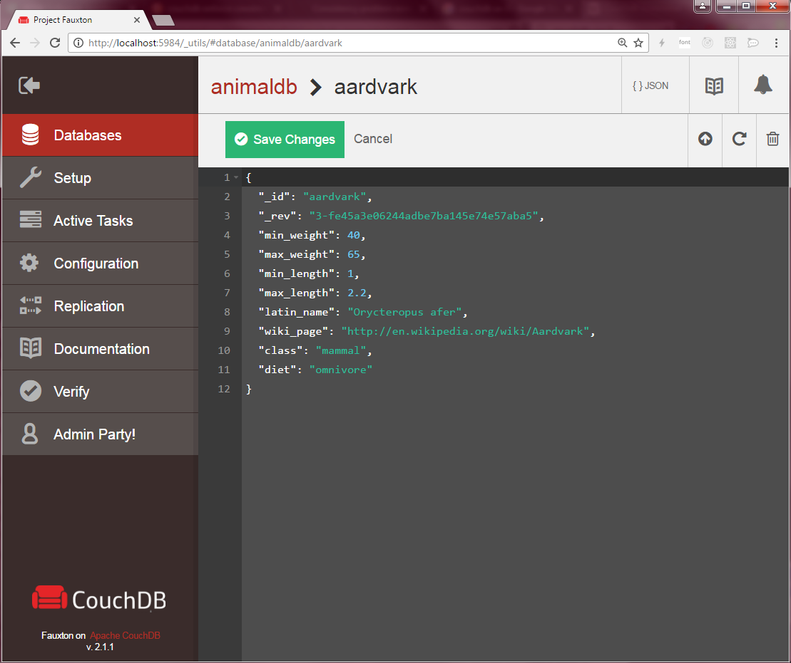

<!--
N.B.: This README was automatically generated by https://github.com/YunoHost/apps/tree/master/tools/README-generator
It shall NOT be edited by hand.
-->

# CouchDB for YunoHost

[](https://dash.yunohost.org/appci/app/couchdb)    
[](https://install-app.yunohost.org/?app=couchdb)

*[Lire ce readme en français.](./README_fr.md)*

> *This package allows you to install CouchDB quickly and simply on a YunoHost server.
If you don't have YunoHost, please consult [the guide](https://yunohost.org/#/install) to learn how to install it.*

## Overview

Couchdb is a database system, where entries are json objects (allowing attachments), and that you can access and synchronize via simple http requests.

As explained in wikipedia:
> Apache CouchDB is an open-source document-oriented NoSQL database, implemented in Erlang.

And as described in the couchdb official website:
> Seamless multi-master sync, that scales from Big Data to Mobile, with an Intuitive HTTP/JSON API and designed for Reliability.


**Shipped version:** 3.3.0-RC1~ynh1

## Screenshots



## Disclaimers / important information

## Configuration

You can do most configuration of CouchDB from fauxton, the web interface, accessible at the domain you specified: `https://domain.tld/_utils/index.html`

## Documentation and resources

* Official app website: <https://couchdb.apache.org/>
* Official admin documentation: <https://docs.couchdb.org/en/stable/>
* Upstream app code repository: <https://github.com/apache/couchdb>
* YunoHost documentation for this app: <https://yunohost.org/app_couchdb>
* Report a bug: <https://github.com/YunoHost-Apps/couchdb_ynh/issues>

## Developer info

Please send your pull request to the [testing branch](https://github.com/YunoHost-Apps/couchdb_ynh/tree/testing).

To try the testing branch, please proceed like that.

``` bash
sudo yunohost app install https://github.com/YunoHost-Apps/couchdb_ynh/tree/testing --debug
or
sudo yunohost app upgrade couchdb -u https://github.com/YunoHost-Apps/couchdb_ynh/tree/testing --debug
```

**More info regarding app packaging:** <https://yunohost.org/packaging_apps>
