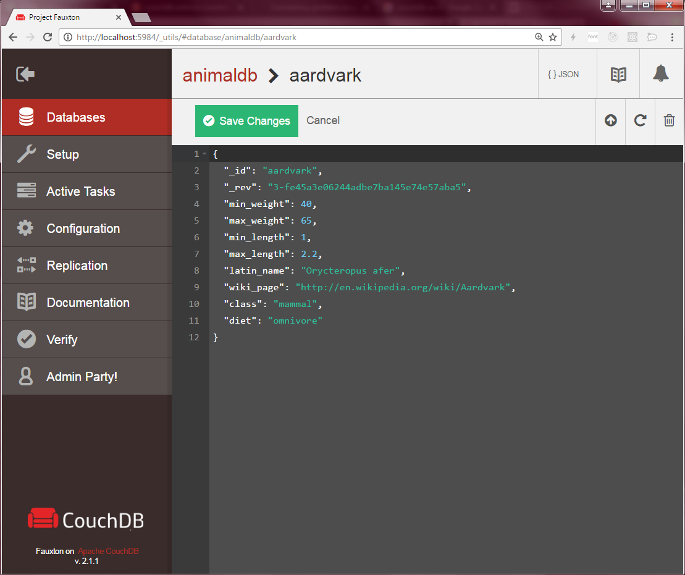

<!--
注意：此 README 由 <https://github.com/YunoHost/apps/tree/master/tools/readme_generator> 自动生成
请勿手动编辑。
-->

# YunoHost 上的 CouchDB

[](https://dash.yunohost.org/appci/app/couchdb)  

[](https://install-app.yunohost.org/?app=couchdb)

*[阅读此 README 的其它语言版本。](./ALL_README.md)*

> *通过此软件包，您可以在 YunoHost 服务器上快速、简单地安装 CouchDB。*  
> *如果您还没有 YunoHost，请参阅[指南](https://yunohost.org/install)了解如何安装它。*

## 概况

Couchdb is a database system, where entries are json objects (allowing attachments), and that you can access and synchronize via simple http requests.

As explained in wikipedia:
> Apache CouchDB is an open-source document-oriented NoSQL database, implemented in Erlang.

And as described in the couchdb official website:
> Seamless multi-master sync, that scales from Big Data to Mobile, with an Intuitive HTTP/JSON API and designed for Reliability.


**分发版本：** 3.2.2~ynh3

## 截图



## 文档与资源

- 官方应用网站： <https://couchdb.apache.org/>
- 官方管理文档： <https://docs.couchdb.org/en/stable/>
- 上游应用代码库： <https://github.com/apache/couchdb>
- YunoHost 商店： <https://apps.yunohost.org/app/couchdb>
- 报告 bug： <https://github.com/YunoHost-Apps/couchdb_ynh/issues>

## 开发者信息

请向 [`testing` 分支](https://github.com/YunoHost-Apps/couchdb_ynh/tree/testing) 发送拉取请求。

如要尝试 `testing` 分支，请这样操作：

```bash
sudo yunohost app install https://github.com/YunoHost-Apps/couchdb_ynh/tree/testing --debug
或
sudo yunohost app upgrade couchdb -u https://github.com/YunoHost-Apps/couchdb_ynh/tree/testing --debug
```

**有关应用打包的更多信息：** <https://yunohost.org/packaging_apps>
